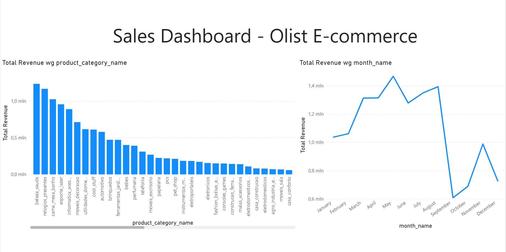

# E-commerce Data Pipeline: Postgres, Docker & Power BI

## Overview
This project demonstrates a complete End-to-End Data Engineering workflow. The process involves transforming raw e-commerce transaction data (Olist dataset) into a professional business dashboard, implementing a scalable data architecture.

## Technical Stack
* Database: PostgreSQL 16
* Infrastructure: Docker & Docker Compose
* Modeling: SQL (DBeaver)
* BI & Analytics: Power BI (DAX)

## Key Features
* Containerization: The entire database environment is isolated in a Docker container, ensuring consistency and easy deployment.
* Star Schema Modeling: Implementation of a relational model consisting of a Fact Table (fact_sales) and multiple Dimension Tables (dim_product, dim_customer, dim_date) to optimize analytical query performance.
* ETL Process:
    * Staging: Data ingestion from CSV files.
    * Transformation: Cleaning and structuring data using SQL scripts.
    * Optimization: Implementation of B-Tree indexes and Primary/Foreign Key constraints.
* Advanced Analytics: Development of complex measures in DAX (Total Revenue, Total Orders) to provide business insights.

## Repository Structure
* 01_setup_staging.sql - Raw table creation and schema setup.
* 02_star_schema.sql - Transformation logic and star schema deployment.
* 03_performance_tuning.sql - Indexes and materialized views for performance.
* docker-compose.yml - Database infrastructure configuration.
* Dashboard_Olist.png - Visual representation of the final report.

## Final Dashboard Preview

